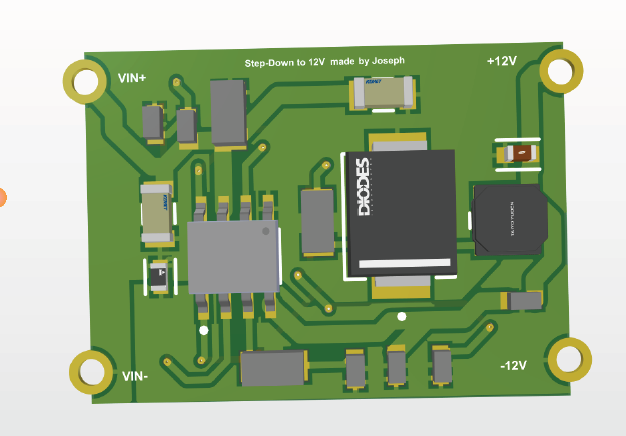
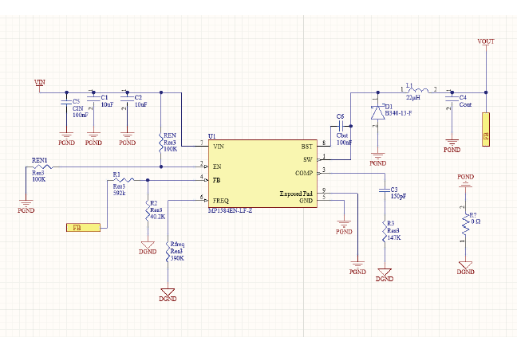
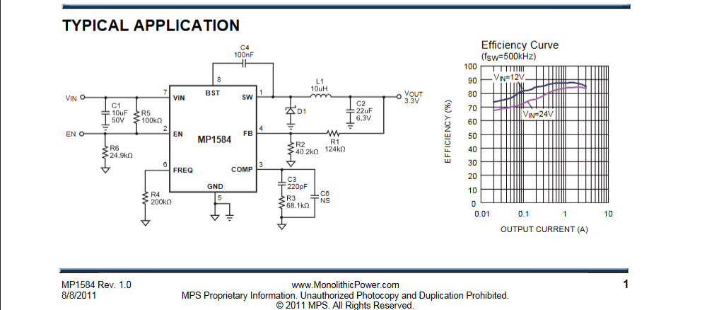
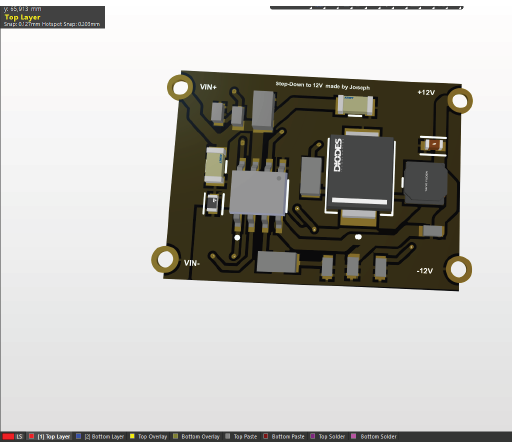
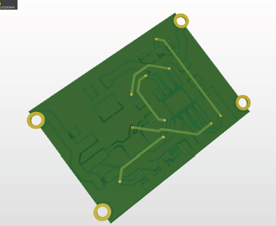
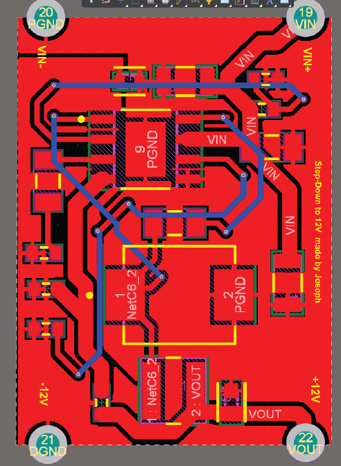
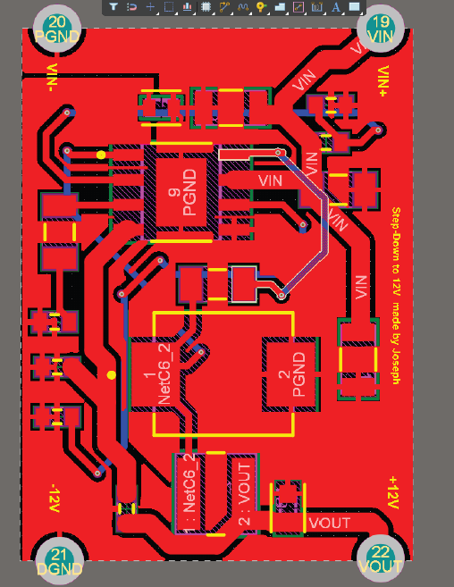

<div align="center">

# MP1584EN 12 V Buck Regulator Module

### Compact DC-DC step-down power module designed in Altium Designer for PowerBoard integration

[](https://www.monolithicpower.com/en/mp1584.html)
[](https://www.altium.com/altium-designer)


**A solderable power module: VIN in, regulated +12 V out, with split power and signal grounds joined at a single controlled point.**

<br>



</div>

---

## Overview

This project is the design of a **DC-DC buck regulator module** based on the **Monolithic Power Systems MP1584EN**, converting a higher input voltage into a regulated **+12 V rail**.

The board is designed as a standalone power module that can be soldered onto a larger **PowerBoard** through peripheral edge pads, following the concept of commercially available power modules.

The design covers the complete hardware development flow:

* Datasheet analysis
* Schematic design
* Component selection
* Feedback and compensation network
* Power-stage PCB layout
* PGND / DGND partitioning
* Thermal management
* Mechanical integration
* DRC verification
* STEP 3D export

> **Design status:** PCB designed and routed. The module has not yet been fabricated, therefore electrical, efficiency and thermal measurements are still pending.

---

## Specifications

| Parameter                      | Value                                  |
| ------------------------------ | -------------------------------------- |
| **Controller**                 | MP1584EN — Monolithic Power Systems    |
| **Topology**                   | Asynchronous buck converter            |
| **Input voltage**              | ~14 V to 24 V practical range          |
| **Controller operating range** | 4.5 V to 28 V                          |
| **Output voltage**             | +12 V regulated                        |
| **Target output current**      | Up to ~3 A, thermally limited          |
| **Switching frequency**        | Set by external resistor               |
| **Frequency range**            | 100 kHz to 1.5 MHz                     |
| **Inductor**                   | 22 µH                                  |
| **Freewheeling diode**         | B340 Schottky, 40 V / 3 A              |
| **Feedback reference**         | 0.8 V                                  |
| **Ground architecture**        | PGND / DGND split with single 0 Ω link |
| **EDA**                        | Altium Designer                        |
| **Mechanical output**          | STEP 3D model                          |

### Input voltage range

The practical input range is approximately **14 V to 24 V**.

A buck converter can only step down voltage. To maintain a regulated +12 V output, the input must remain above the output voltage plus the converter's voltage headroom, including diode drop, inductor losses and maximum duty-cycle limitations.

The upper limit is kept below the MP1584EN's 28 V maximum input rating to provide operating margin.

---

## Electrical Architecture

```text
             ┌───────────────────────────────────────────────────────────┐
 VIN+ ──┬──► │ VIN                 MP1584EN                         SW   │──┬──► L 22 µH ──┬──► +12 V
        │    │                                                         │  │               │
     C_IN    │ EN        FREQ ── R_freq        BST ── C_BST ── SW      │  ▼               C_OUT
  bulk +     │                                                         │ B340              │
 decoupling  │ FB ◄── R1/R2 divider ◄─────────────────────────────────┼─ Schottky         │
        │    │ COMP ── R3 / C3                                         │  │               │
        │    └──────────────┬───────────────────────────────┬──────────┘  │               │
        │                 DGND                    Exposed pad (PGND)       │               │
        └──────────────────┴────────────── 0 Ω ────────────┴──────────────┴───────────────┘
                           signal ground       single link       power ground
```

The design separates the **power return currents** from the **small-signal regulation circuitry**, with a single controlled connection between PGND and DGND.

---

## Output Voltage Setting

The MP1584EN regulates its feedback pin to approximately **0.8 V**.

The output voltage is defined by the feedback divider:

$$
V_{OUT} = V_{FB}\left(1+\frac{R_1}{R_2}\right)
$$

For a +12 V output:

$$
12 = 0.8\left(1+\frac{R_1}{R_2}\right)
$$

Therefore:

$$
\frac{R_1}{R_2}=14
$$

The resistor divider is therefore selected to provide a feedback voltage of approximately 0.8 V at the regulated output.

---

## Duty Cycle

For an ideal buck converter operating in continuous conduction:

$$
D = \frac{V_{OUT}}{V_{IN}}
$$

For the selected operating range:

* At **VIN = 14 V**:

$$
D \approx \frac{12}{14} \approx 0.86
$$

* At **VIN = 24 V**:

$$
D = \frac{12}{24}=0.5
$$

The high duty cycle close to the minimum input voltage is one of the reasons why the practical minimum input voltage is kept around 14 V.

---

# Schematic



The schematic follows the MP1584EN reference design while adapting the power stage and grounding strategy to the intended modular PowerBoard integration.

### Main functions

| Function              | Implementation                                             |
| --------------------- | ---------------------------------------------------------- |
| **Input filtering**   | Bulk capacitor + ceramic decoupling close to VIN           |
| **Power stage**       | Internal high-side switch + B340 Schottky + 22 µH inductor |
| **Output filtering**  | Output capacitor on +12 V                                  |
| **Regulation**        | R1 / R2 feedback divider                                   |
| **Loop compensation** | R3 / C3 network on COMP                                    |
| **High-side drive**   | Bootstrap capacitor between BST and SW                     |
| **Frequency setting** | External resistor on FREQ                                  |
| **Ground connection** | 0 Ω resistor between PGND and DGND                         |

<details>
<summary><b>Datasheet reference design</b></summary>

<br>



*Reference: MP1584EN datasheet, Monolithic Power Systems.*

</details>

---

# PCB Design

## 3D Board Views

### Top view


### Black soldermask variant



### Bottom view



---

## 2D Layout

### Top Layer



### PGND / DGND Partitioning



---

## PCB Layout Decisions

### 1. High di/dt Loop Minimisation

The critical switching loop was kept as compact as possible:

```text
VIN → SW → diode → inductor → COUT → PGND → CIN
```

Key layout decisions:

* Power components placed close to the MP1584EN.
* Short and wide copper traces used for the high-current path.
* Input capacitors placed directly near the VIN / PGND pins.
* Switching-current loops kept physically small.

This reduces:

* Switching noise
* Voltage ringing
* EMI
* Parasitic inductance

---

### 2. PGND / DGND Separation

The design intentionally separates the power and signal ground regions.

| Ground   | Connected to                                                                      |
| -------- | --------------------------------------------------------------------------------- |
| **PGND** | Schottky diode, inductor return, input/output capacitors and MP1584EN exposed pad |
| **DGND** | Feedback divider, COMP network and frequency-setting circuitry                    |

The objective is to prevent large switching return currents from flowing through the sensitive regulation references.

---

### 3. Single PGND / DGND Connection

One of the main PCB design decisions was determining how the two ground domains should be connected.

#### Initial approaches

Two approaches were investigated:

* Direct polygon merging
* Net-tie / short-circuit rules in the EDA tool

Both approaches made the exact connection point less explicit.

#### Final solution

A dedicated **0 Ω resistor** was used to connect PGND and DGND.

This provides:

* One clearly defined connection point
* A physically controllable grounding strategy
* Easy debugging and modification
* Clear separation in the PCB layout

The resistor can also be removed during debugging if the two ground domains need to be evaluated independently.

---

### 4. Exposed Pad and Thermal Design

The MP1584EN exposed pad is connected to **PGND** and serves both electrical and thermal purposes.

The PCB therefore uses:

* Large copper area around the IC
* Copper underneath the exposed pad
* Thermal vias to transfer heat to the opposite layer

This is particularly important when approaching the target 3 A load current.

---

### 5. Modular Mechanical Integration

The regulator is designed as a self-contained module with peripheral pads for:

```text
VIN+
GND
+12 V
```

The module is intended to be soldered onto a larger PowerBoard.

The edge pads are **not true plated castellations**, but the current implementation provides a simple and manufacturable approach for module-to-board integration.

A STEP model is included for mechanical integration:

```text
Regulator MP1584EN.step
```

---

# Design Rule Verification

The PCB was checked using the Altium Designer Design Rule Check workflow.

The generated DRC outputs are included in:

```text
Project Outputs for Regulator MP1584EN/
├── Design Rule Check - Regulator MP1584EN.drc
└── Design Rule Check - Regulator MP1584EN.html
```

---

# Project Status

| Item                                          | Status         |
| --------------------------------------------- | -------------- |
| Schematic based on datasheet reference design | ✅ Done         |
| Component selection                           | ✅ Done         |
| PCB routing                                   | ✅ Done         |
| PGND / DGND partitioning                      | ✅ Done         |
| Single 0 Ω ground link                        | ✅ Done         |
| Thermal layout                                | ✅ Done         |
| STEP export                                   | ✅ Done         |
| DRC verification                              | ✅ Done         |
| PCB fabrication                               | ⏳ Not yet done |
| Output voltage measurement                    | ⏳ Pending      |
| Output ripple measurement                     | ⏳ Pending      |
| Efficiency characterisation                   | ⏳ Pending      |
| Thermal test at 3 A                           | ⏳ Pending      |

> **Important:** No electrical performance measurements are reported because the PCB has not yet been manufactured.

---

# Repository Structure

```text
.
├── asset/
│   └── images/
│       ├── mp1584en_datasheet_typical_application.png
│       ├── pcb_2d_layout_pgnd_dgnd.png
│       ├── pcb_2d_top_layer.png
│       ├── pcb_3d_bottom_view.png
│       ├── pcb_3d_top_view.png
│       ├── pcb_3d_top_view_black.png
│       └── schematic_mp1584en_buck.png
│
├── Project Outputs for Regulator MP1584EN/
│   ├── Design Rule Check - Regulator MP1584EN.drc
│   └── Design Rule Check - Regulator MP1584EN.html
│
├── .gitignore
├── README.md
├── Regulator MP1584EN.PcbDoc
├── Regulator MP1584EN.PrjPcb
├── Regulator MP1584EN.SchDoc
└── Regulator MP1584EN.step
```

Open `Regulator MP1584EN.PrjPcb` with **Altium Designer** to load the complete project.

---

# Limitations

The current revision has several limitations:

* The PCB has not yet been fabricated.
* Electrical and thermal performance have therefore not been experimentally validated.
* The practical minimum input voltage is approximately 14 V.
* The asynchronous topology uses a Schottky diode, which limits efficiency at higher load currents.
* The edge pads are not true castellations.
* The MP1584EN is marked **"Not Recommended for New Designs"** by MPS, with the MP2338 suggested as a possible replacement for a future revision.

---

# Lessons Learned

This project highlighted several practical PCB and power-electronics considerations:

* **Ground partitioning requires an intentional connection point.**
* **The exposed pad is both an electrical and thermal connection.**
* **The smallest switching loop is usually the best switching loop.**
* **A simple, controllable solution can be preferable to a more elegant EDA-only solution.**
* **Mechanical and manufacturing constraints directly influence PCB architecture.**
* **Datasheet reference designs provide a starting point, but PCB implementation requires additional layout decisions.**

---

# Next Steps

* [ ] Generate Gerber and drill files
* [ ] Generate BOM and Pick & Place files
* [ ] Manufacture the PCB
* [ ] Measure output voltage and load regulation
* [ ] Measure output ripple
* [ ] Characterise efficiency from 0.1 A to 3 A
* [ ] Measure IC and diode temperature at full load
* [ ] Evaluate a synchronous MP2338-based replacement
* [ ] Integrate the regulator onto the target PowerBoard

---

# Skills

**Power Electronics** · **Buck Converter Design** · **Datasheet-Driven Design** · **Altium Designer** · **Power PCB Layout** · **Ground Partitioning** · **Thermal Design** · **Hardware Integration** · **STEP / 3D CAD Export**

---

# Author

**Joseph Mbode**

Embedded Systems Engineer · Electronics & PCB Design

* [LinkedIn](https://www.linkedin.com/in/joseph-mbode)
* [GitHub](https://github.com/Josephulrich)
